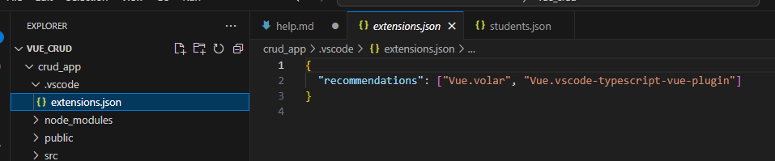

# This document  will be used to help you in developing the project

- i follow this video to do this project
    - https://www.youtube.com/watch?v=PrKh6GemOyg

- https://vuejs.org/guide/quick-start.html#creating-a-vue-application

- `npm create vue@latest`
    - this will create a vue project
    - type `.` to create the project in the current directory (for this to work you would  need an empty folder)
    - but  i am going to use a diff project name
    - except for vue router  , give no to all the other options
- 
    - vscode gives a suggestion to install the extension
    - install it